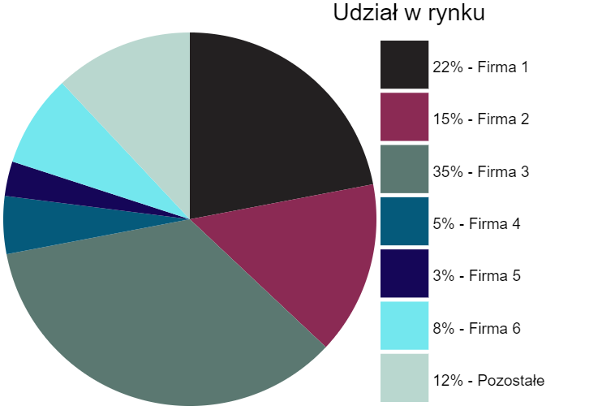

# ChartJS


## Przegląd

Działanie biblioteki można sprawdzić na przygotowanych przykładach pod poniższym linkiem:


## Opis

Autorska biblioteka javascriptowa do wizualizacji danych za pomocą wykresów kołowych i słupkowych. Opiera sie na rysowaniu wykresów na canvasie.

Biblioteka może być wykorzystywana w dowolnym projekcie.


## Technologie

* HTML
* Javascript
* RequireJS


## Jak używać?

Wystarczy dodać do htmla główny plik script.js:

```html
<script src="./script.js"></script>
```

Następnie można wykorzystać kod w przykładowy sposób:

```javascript
let chart1 = document.getElementById("canvas1");
let pieChartExample1 = new PieChart(
    {
        canvas: chart1,
        dataValues: [22, 15, 35, 5, 3, 8, 12],
        dataList: ["Firma 1", "Firma 2", "Firma 3", "Firma 4", "Firma 5", "Firma 6", "Pozostałe"],
        title: "Udział w rynku",
        checkPercentage: true
    }
);
pieChartExample1.render();
```


## Przykłady

1. Wykres kołowy przedstawiający procentowy udział w rynku kilku konkurencyjnych firm.



   
2. Wykres słupkowy przedstawiający sprzedaż towarów (w sztukach) w firmie w jednym roku kalendarzowym.


3. Bibliotekę można również wykorzystywać do wizualizacji danych zmieniających się dynamicznie.


